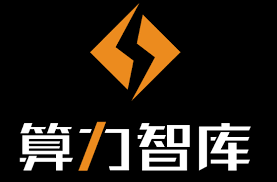

# Workshop Program Overview

# Keynote Talks

## Keynote I: Federated Learning Systems: A New Holy Grail for System Research in Data Privacy and Protection?

### Prof. Bingsheng He

Associate Professor,
National University of Singapore 

### Abstract

Federated learning has been a hot research area in enabling the collaborative training of machine learning models among different organizations under the privacy restrictions. As researchers try to support more machine learning models with different privacy-preserving approaches, there is a requirement in developing systems and infrastructures to ease the development of various federated learning algorithms. Just like deep learning systems such as Caffe, PyTorch, and Tensorflow that boost the development of deep learning algorithms, federated learning systems are equivalently important, and face challenges from various issues such as unpractical system assumptions, scalability and efficiency. Inspired by federated systems in other fields such as databases and cloud computing, we study the system design requirements for federated learning systems. We find that two important features for federated systems in other fields, i.e., heterogeneity and autonomy, are rarely considered in the existing federated learning systems. In this talk, we will take a systematic comparison among the existing federated learning systems and present our research progress and future system research opportunities and directions.

More details about our research can be found at [http://www.comp.nus.edu.sg/~hebs/](http://www.comp.nus.edu.sg/~hebs/) and related survey [https://arxiv.org/abs/1907.09693](https://arxiv.org/abs/1907.09693). 

### Speaker Bio

Dr. Bingsheng He is currently an Associate Professor and Vice-Dean (Research) at School of Computing, National University of Singapore. Before that, he was a faculty member in Nanyang Technological University, Singapore (2010-2016), and held a research position in the System Research group of Microsoft Research Asia (2008-2010), where his major research was building high performance cloud computing systems for Microsoft. He got the Bachelor degree in Shanghai Jiao Tong University (1999-2003), and the Ph.D. degree in Hong Kong University of Science & Technology (2003-2008). His current research interests include cloud computing, database systems and high performance computing. His papers are published in prestigious international journals (such as ACM TODS and IEEE TKDE/TPDS/TC) and proceedings (such as ACM SIGMOD, VLDB/PVLDB, ACM/IEEE SuperComputing, ACM HPDC, and ACM SoCC). He has been awarded with the IBM Ph.D. fellowship (2007-2008) and with NVIDIA Academic Partnership (2010-2011). Since 2010, he has (co-)chaired a number of international conferences and workshops, including IEEE CloudCom 2014/2015, BigData Congress 2018 and ICDCS 2020. He has served in editor board of international journals, including IEEE Transactions on Cloud Computing (IEEE TCC), IEEE Transactions on Parallel and Distributed Systems (IEEE TPDS), IEEE Transactions on Knowledge and Data Engineering (TKDE), Springer Journal of Distributed and Parallel Databases (DAPD) and ACM Computing Surveys (CSUR). He has got editorial excellence awards for his service in IEEE TCC and IEEE TPDS in 2019. 

## Keynote II: Federated Learning Systems: A New Holy Grail for System Research in Data Privacy and Protection?

### Dr. Jiaping Wang (王嘉平)

CEO, Moqun Computing (墨群计算)

Former Lead Researcher, Microsoft Research 

### Abstract

Blockchain systems introduced a new computing paradigm that no computing system achieved before, to establish a computing process avoids coupling with particular hardware deployment and thus prevents being controlled by the hardware owner or the creator of the system. This ensures equal roles for all participants in a distributed system. Cryptocurrency (e.g. Bitcoin) fully leverages the democratizing nature of the blockchain system to achieve the world-wide trust without endorsement from any authority. Such capability can be employed for broader applications in human society for finance, governance, collaboration and social interactions. 
Scalability is the top technical challenge that blockchain systems are encountered, which must be solved before adopting in sectors with much higher complexity and larger scale beyond cryptocurrency. We proposed parallel architecture to linearly scale out the blockchains sytem to match with the production needs. It is particular challenge to parallelize the blockchain system without weakening the democratizing nature and security. The talk will introduce the architecture that we have done and published on NSDI 2019, and follow up works regarding the programmability and production on top of it.

More details about our research can be found at [https://www.usenix.org/conference/nsdi19/presentation/wang-jiaping](https://www.usenix.org/conference/nsdi19/presentation/wang-jiaping)

### Speaker Bio

Dr. Jiaping Wang is currently the CEO and founder of Moqun computing Ltd focus on cutting edge technologies for distributed systems like blockchains and overlay networks.  Before that, he held a research position in the ATG of Microsoft Research and IG of Microsoft Research Asia, where his research interests cover high performance computing, distributed GPU farms for machine learning and computer graphics. His works are published in prestigious journals (ACM ToG, IEEE TVCG) and top conferences (ACM SIGGRAPH, USENIX/NSDI). He is inventor of tens of granted US patents based on his academia works. Dr. Jiaping Wang received Ph.D. degree in Institute of Computing Technology of the Chinese Academy of Sciences, advised by Dr. Harry Shum, former Executive Vice President of Microsoft. 

# Invited Talks

## Invited Talk I:  Decentralized Data Crowdsourcing: Fair, Private, and even Super Cheap

### Dr. Qiang Tang

Assistant professor, New Jersey Institute of Technology

### Abstract

Many popular Apps and platforms deploy certain crowdsourcing mechanisms to facilitate the sharing economy. Over the years, concerns like fairness, data privacy have become more significant. In this talk, I will briefly survey our recent work on decentralized crowdsourcing facilitated by blockchain, and interesting findings we learnt along the way.

### Speaker Bio

Qiang Tang is currently an assistant professor at New Jersey Institute of Technology, and also a director of JD-NJIT-ISCAS joint blockchain lab. Before joining NJIT, he was a postdoc at Cornell IC3. His research interests lie broaderly on applied cryptography and blockchain technology, and most of his work published at flagship venues of cryptography, computer security, and distributed computing venues. He won a few awards including MIT TR 35, China 2019 and a Google Faculty Award.

## Invited Talk II:  Efficient Privacy-Preserving Federated Learning

### Dr. Zengxiang Li

Scientist, Institute of High Performance Computing, A*STAR, SINGAPORE

### Abstract

### Speaker Bio

## Invited Talk III:  A Reliable Storage Partitioning for Permissioned Blockchain

### Dr. Cheqinq Jin

Professor, East China Normal University

### Abstract

### Speaker Bio

Prof. Cheqing Jin is a professor and vice dean of the School of Data Science and Engineering, East China Normal University. He is a senior member of China Computer Federation Technical Committee on Databases. His research interests include blockchain, data stream management, location-based services, uncertain data management and so on.  He was the PI of several National Natural Science Foundations, and has co-authored 1 Monograph and more than 100 papers.

## Overview

With the advent of Bitcoin, a cryptographically-enabled peer-to-peer digital payment system, blockchain together with a whole package of distributed ledger technologies, which serve as the underlying foundation of all the crypto-currencies, have been gaining attention from both academia and industry in the last decade. Furthermore, the recent years have witnessed tremendous momentum in the development of blockchain and distributed ledger technologies， largely due to the impressive rise in the market capital of these digital tokens.  More and more industries, from banking and insurance, to supply chain and e-commerce, are quickly realizing the great potential in blockchain technology in efficiency boost, process automation and secure data sharing across otherwise isolated data silos.  

Blockchains are distributed ledgers that enable parties who do not fully trust one another to maintain a set of global states. The parties agree on the existence, values, and histories of the states. Most attention and research so far have been devoted to the underlying technologies from the database, distributed architecture, cryptography and consensus aspects, primarily because the priority as yet has been attached to the feasibility, stability and scalability of the platforms.  Yet, as it has been gaining increasing awareness that the greatest potential of blockchain and distributed technologies lies in unleashing a whole new economy empowered by the capabilities to convert a rich class of emerging class of virtual assets into attributable value, including a long list of promising new concepts such as influence, social capital, swarm intelligence, personal data and credit.  How to bring the greatest value out of the various types of new “on-chain” data in the blockchain setting becomes an urgent task.  Consequently, it is both important and challenging to explore a wealth of interesting new research topics in this new setting that fall broadly under the scope of KDD yet with the unique requirement to achieve the optimal balance among data utility, security and privacy.  
 
The workshop aims to provide a venue at SIGKDD for developers, practitioners, and researchers from different background to discuss how the unique properties of blockchain and distributed ledger that benefit current and future applications, particular from the perspective of integrating data mining, analysis and intelligence into the underlying framework.   To best integrate with KDD community and scope, we have proposed the special theme of “Smart Data” to highlight the mission and focus of this workshop.  Due to COVID-19 situation, this year's workshop will be held online on August 24, 20120 in conjunction with the ACM SIGKDD 2020.

## Call For Papers

The Second International Workshop on Smart Data for Blockchain and Distributed Ledger (SDBD’20) aims to bring together practitioners and researchers with a specific focus on the emerging trends and industry needs associated with the AI, data mining, data governance, data privacy and other topics under the “Smart Data” framework. Both theoretical and experimental submissions are encouraged. Topics of interest include but are not limited to:

- Data mining in distributed ledger setting
- Privacy-preserving AI and data mining in blockchain and distributed setting
- Secure data sharing through blockchain
- Applications and use cases of blockchain
- Algorithm design, complexity analysis, implementation for blockchain
- Benchmarking and performance study
- Blockchain consensus protocols
- Blockchain protocol analysis and security
- Data provenance
- Distributed ledgers
- Data analytics on blockchain
- Data governance
- Data stores for blockchain
- Execution engine
- Systems: Hyperledger. Corda, Ethereum, EOS, etc
- Secure smart contracts
- Throughput and scalability

## Submission Guidelines

We invite submissions for original research papers both theory and application-oriented as well as submissions from the research track and applied data science track of the main conference. We encourage the participants to submit papers on novel datasets and release them to advance the field. Papers must be submitted in PDF according to the [ACM Proceedings Template](https://www.acm.org/publications/proceedings-template) in a single-blind format (including author names and affiliations). We welcome both long papers (maximum length of 9 pages) and short papers (maximum length of 5 pages). The accepted papers will be published on the workshop’s website, and will not be considered archival for resubmission purposes. Please submit your papers at the [EasyChair submission link](https://easychair.org/account/signin_timeout?l=0Gqswiuc95cQEulHDdOfPc#).
 

## Key Dates

All deadlines are 11:59 PM Pacific Standard Time

- Workshop paper submissions:  June 25, 2020

- Workshop paper notifications: June 30, 2020

- Workshop date: August 24, 2020

## Workshop Co-Chairs

- Feida Zhu (Singapore Management University)
- Jian Pei (Simon Fraser University)
- Zijiang James Yang,  (Western Michigan University )
- Xiaokui Xiao (National University of Singapore)

## Industrial & Media Partners

Please email fdzhu@smu.edu.sg  for any questions.

